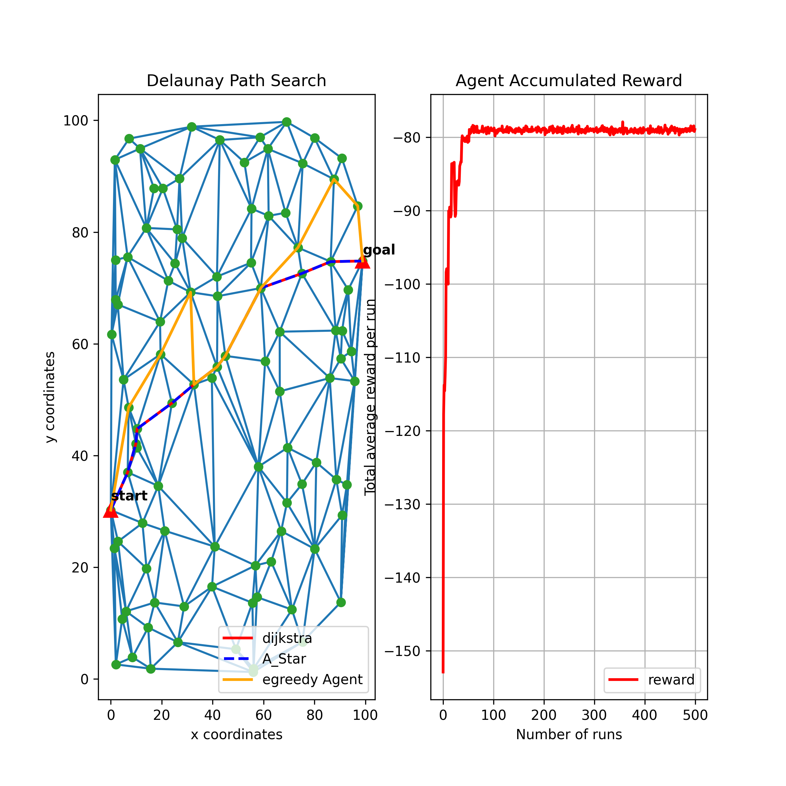
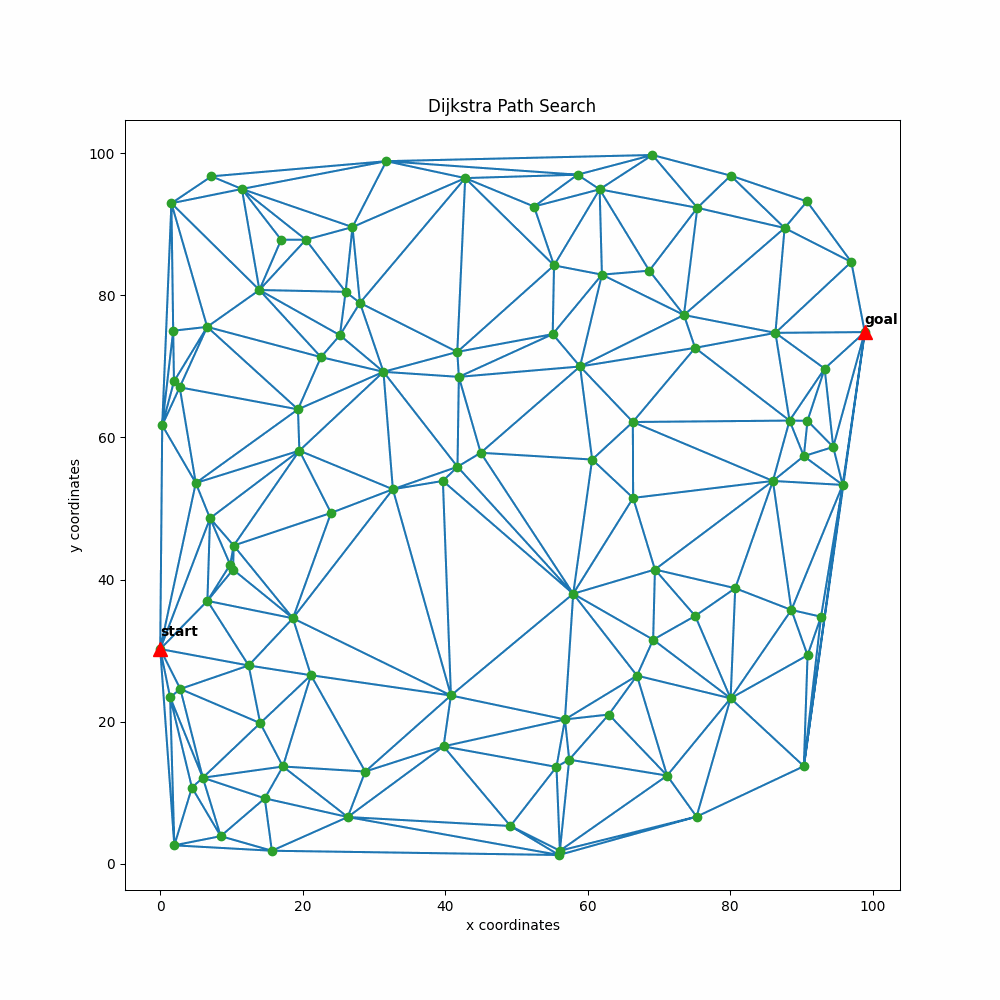
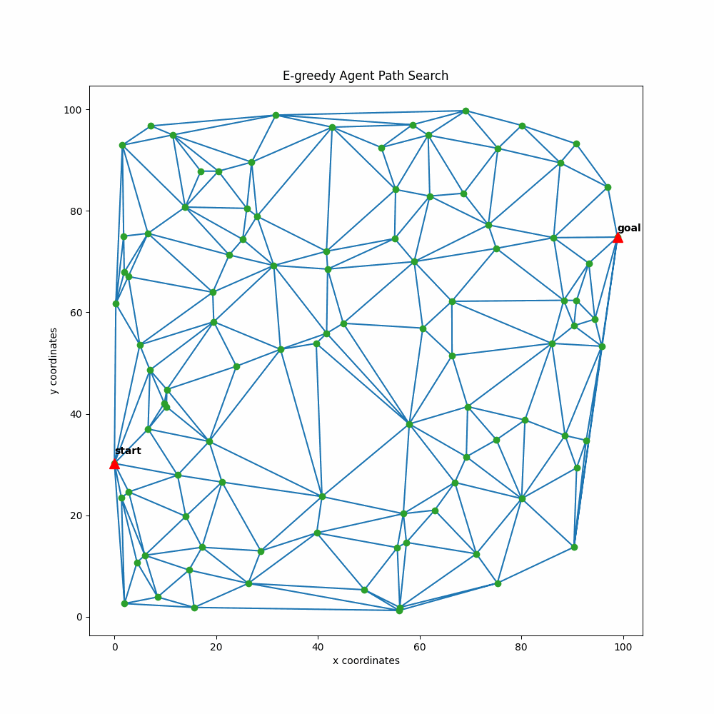

# Q-Routing in a Delaunay Network

Background
==========

This project compares Dijkstra, A* and Q-routing path search from a start location to a goal location in a delaunay network diagram. Dijkstra and A* algorithm return one optimal path out of best possible options. However, Q-routing path search trades-off between exploitation and exploration in returning an optimal path. The results of the algorithms are given under Results sub-heading.

Results
=======
## Path Search

* The figure above shows that Dijkstra and A* optimal path are the same. Q-routing optimal path is quite different because of the agent's trade-off between exploitation and exploration. Moreover, the agent found its optimal path after 60 runs.

## Animation
* Dijkstra path Search
 

* A Star Path Search

* Q-routing Path Search

